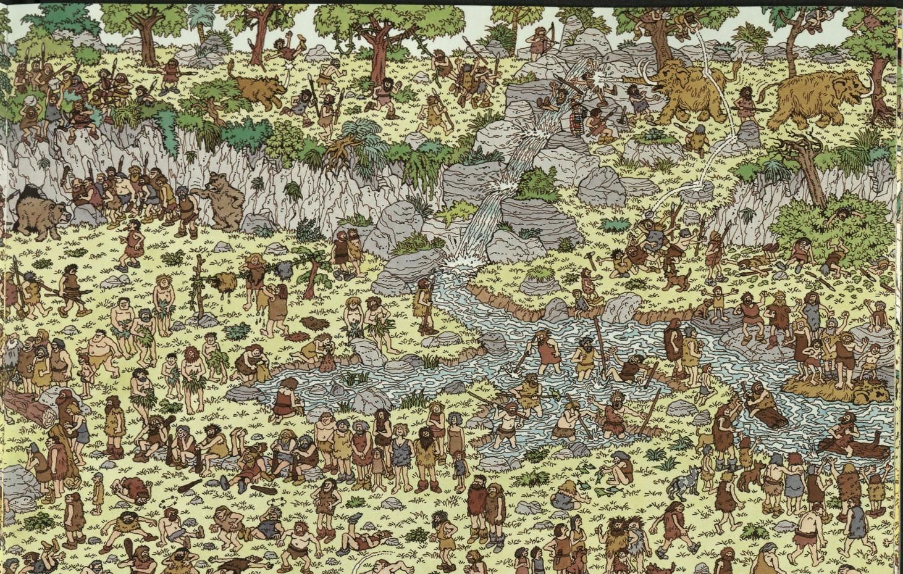
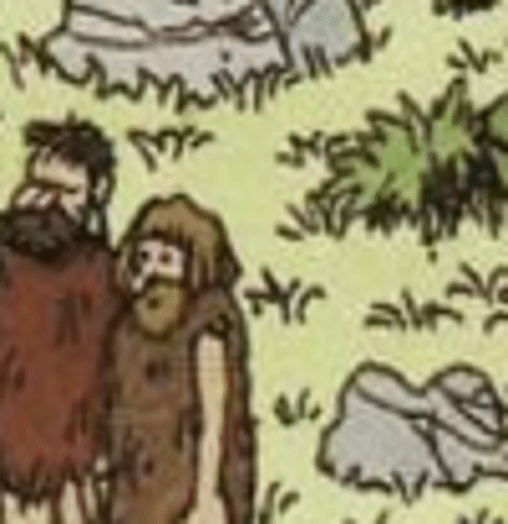
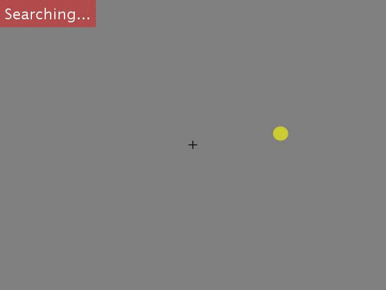
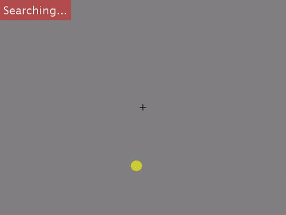
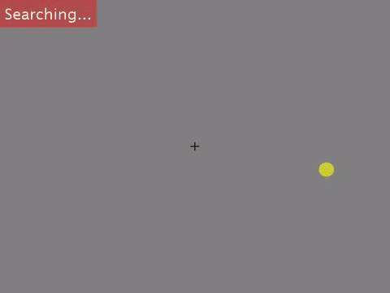
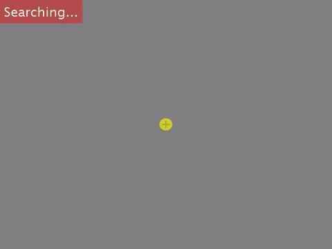

# Finding any Waldo with Zero-shot Invariant and Efficient Visual Search 

Authors: Mengmi Zhang, Jiashi Feng, Keng Teck Ma, Joo Hwee Lim, Qi Zhao, and Gabriel Kreiman

This repository contains an implementation of a zero-shot deep learning model for invariant and efficient visual search. Our paper is published in Nature Communication.

Free access to our manuscript [HERE](https://www.nature.com/articles/s41467-018-06217-x), supplementary material [HERE](http://klab.tch.harvard.edu/publications/PDFs/gk7627_supplement.pdf)

Given the high demand for our code, we have provided the implementation in Python as well. The link to the Python implenentation is [HERE](https://github.com/ZhangLab-DeepNeuroCogLab/IVSN)

## Project Description

Searching for a target object in a cluttered scene constitutes a fundamental challenge in daily vision. Visual search must be selective enough to discriminate the target from distractors, invariant to changes in the appearance of the target, efficient to avoid exhaustive exploration of the image, and must generalize to locate novel target objects with zero-shot training. Previous work has focused on searching for perfect matches of a target after extensive category-specific training. Here we show for the first time that humans can efficiently and invariantly search for natural objects in complex scenes. To gain insight into the mechanisms that guide visual search, we propose a biologically inspired computational model that can selectively, invariantly and efficiently locate targets, generalizing to novel objects. The model provides an approximation to the mechanisms integrating bottom-up and top-down signals during search in natural scenes.


| [](sampleimg/cropped_2_1.jpg)  | [](sampleimg/waldo.JPG) |[](GIF/AM.gif)  | [](GIF/FP.gif) |
|:---:|:---:|:---:|:---:|
| Stimuli | Target | Attention Map predicted by our model | Fixated Place | 

## Pre-requisite

The code has been successfully tested in MAC OSX and Ubuntu 14.04. Only CPU is required. To speed up computation, GPU is highly recommended (3GB GPU memory at least). 

It requires the deep learning platform Torch7. Refer to [link](http://torch.ch/docs/getting-started.html) for installation.  

Matio package is required (save and load matlab arrays from Torch7). Refer to [link](https://github.com/soumith/matio-ffi.torch) for installation.

Loadcaffe package is required (load pre-trained caffe model to Torch7). Refer to [link](https://github.com/szagoruyko/loadcaffe) for installation.

Run the commands:
```
luarocks install image
luarocks install tds
```
Download our repository:
```
git clone https://github.com/kreimanlab/VisualSearchZeroShot.git
```

Download the caffe VGG16 model from [HERE](https://drive.google.com/open?id=1AEJse0liaT8uJoLmImqhyJN2y2_6mDsJ) and place it in folder ```/Models/caffevgg16/```

## Usage

### Visual search in object arrays

Navigate to the repository folder. To run our search model, copy the following command in the command window:
```
th IVSNtopdown_30_31_array.lua
```
Visualize the generated attention map in MATLAB: ```visAttentionMap_array.m```

### Visual search in natural images

Navigate to the repository folder and run ```PreprocessNaturalDesign.m``` in MATLAB

It preprocesses the search images by cropping it into uniform pieces and saving the paths of the cropped images in ```croppednaturaldesign_img.txt```.

To run our search model, copy the following command in the command window:
```
th IVSNtopdown_30_31_naturaldesign.lua
```
Visualize the generated attention map in MATLAB: ```visAttentionMap_naturaldesign.m```

### Visual search in Waldo images

Navigate to the repository folder and run ```PreprocessWaldoImage.m``` in MATLAB

It preprocesses the search images by cropping it into uniform pieces and saving the paths of the cropped images in ```croppednaturaldesign_img.txt```.

To run our search model, copy the following command in the command window:
```
th IVSNtopdown_30_31_waldo.lua
```
Visualize the generated attention map in MATLAB: ```visAttentionMap_waldo.m```

## Datasets

We have collected human eyetracking data in three increasingly complex visual search tasks: object arrays, natural images and Waldo images. Below are the preview of example trial in each task. Yellow circles denote the eye movements. Red bounding box denotes the ground truth. Correspondingly, we show the eye movement predicted by our computational model.

| [](GIF/array_6.gif)  | [](GIF/naturaldesign_21_subj1.gif) |[](GIF/waldo_31_subj1.gif)  |
|:---:|:---:|:---:|
| Object array (Human) | Natural image (Human) | Waldo image (Human) |

| [](GIF/array_6_model.gif)  | [](GIF/naturaldesign_21_model.gif) |[](GIF/waldo_31_model.gif)  |
|:---:|:---:|:---:|
| Object array (Model) | Natural image (Model) | Waldo image (Model) |

**Note** that we also include one variation of the search task in object arrays. Instead of familiar objects, we collect **novel** objects from [[1]](http://wiki.cnbc.cmu.edu/Novel_Objects) [[2]](http://michaelhout.com/?page_id=759) [[3]](https://www.turbosquid.com/Search/Index.cfm?keyword=alien&max_price=0&min_price=0) and create a dataset of **novel** objects on arrays. See below for **novel** object examples:


You can **download** the complete dataset including the novel object dataset from [Part1](https://drive.google.com/file/d/1ZvmugJDds-CrwTvhIXmyYVxnniNmx7ce/view?usp=sharing), [Part2](https://drive.google.com/open?id=1C4T2Siz6zWxksvDbL549-KnWvJMgoCeh) and [Part3](https://drive.google.com/open?id=1eQzrTVFov1OjGoRAGy75vgDabPrHMoS7) (total size: ~9GB) 

In object arrays, we used cropped objects from MSCOCO and performed post-processing steps, such as color removal, histogram equalization, and random rotations (see our paper for details). If you would like to trace back the objects from the original MSCOCO images, please download the original [MSCOCO2014](https://cocodataset.org/#download) dataset (train2014, val2014 and annotations for 2014) and use ```ReConstructOriginalInstance.m``` in ```ReconstructArrayObjects``` folder to visualize the original objects from MSCOCO. 

It contains the following:
- Part 1: ```Datasets``` folder: contain search images, targets, ground truth, psychophysics (human eyetracking data, MATLAB function to process and extract fixations)
- Part 2: ```Eval``` folder: contain MATLAB files to evaluate cummulative search performance as a function of number of fixations for our computational model across three search tasks 
- Part 2: ```Plot``` folder: contain MATLAB files to reproduce figures in our paper
- Part 2: ```supportingFunc``` folder: add this directory in your MATLAB search path
- Part 3: ```DataForPlot``` Folder: pre-processed results saved in .mat. Place this folder in ```Plot``` folder (Part 2) before using plotting functions 

## Errata

Physical screen size used for stimulus presentation (in mm): 360x295

Physical distance between the computer monitor and the eyetracking camera (in mm): 76.2

Averaged sitting distance between human subjects and the screen (in mm): 660.4

(The measurement errors do not alter major results or conclusions reported in the paper.)
   
## Notes

The source code is for illustration purpose only. Path reconfigurations may be needed to run some MATLAB scripts. We do not provide techinical supports but we would be happy to discuss about SCIENCE!

## License

See [Kreiman lab](http://klab.tch.harvard.edu/code/license_agreement.pdf) for license agreements before downloading and using our source codes and datasets.
